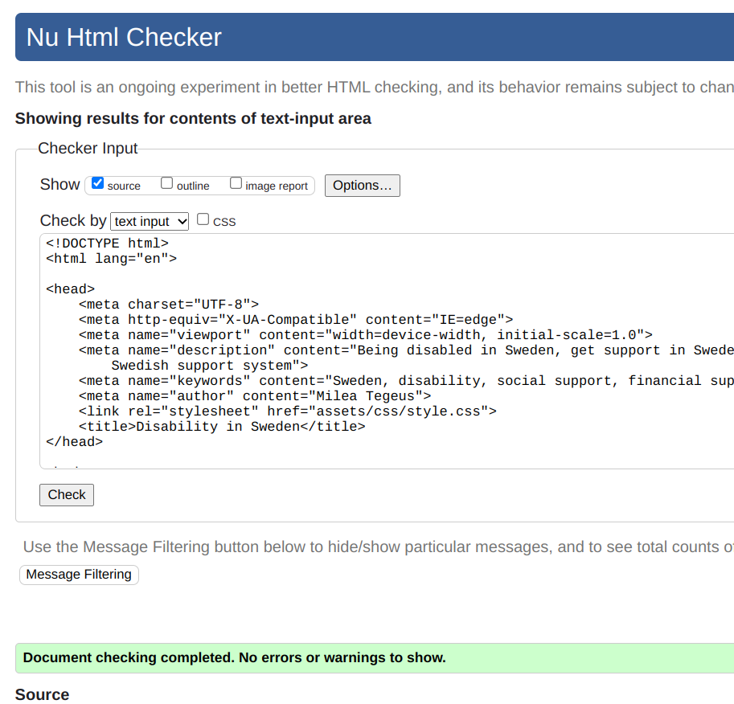

# Disabled in Sweden

Link to the page:

The background story of this website, is actually that I had a dream about creating it. So I did.

The main purpose of this website, is to help people, especially those with disabilities, to easily access information about the Swedish support systems. For example, if they are planning to move to Sweden and need to know about this before moving. The goal is to present the content in an accessible manner. That includes creating the website with accessibility in focus during every step of the way - from choosing the background colors to writing code that is filled with semantics as well as alt-attributes and aria-labels.

Since the topic of the website is about support systems that can assist people with disabilities, I thought it would be a great opportunity to demonstrate what a website, with a main focus on accessibility, could look like. By doing so, the website adds a value to the user in two ways: by presenting valuable content about a topic that otherwise can be very difficult to find and/or understand once found, but also by doing so in a way that is accessible for those with different kind of disabilities. At least that is the goal.

### Implementation

When creating a website with accessibility as the main focus, I was quite limited in what I could and could not do, but I thought it was a fun experience. Even if the site looks simple, I have put a lot of thought into it. This is a list of what and why I did what I did:

* The main colors of the site are blue and yellow. Apparently, people who are colorblind struggle to see red and green, but most of them can see blue and yellow, so that became the two colors I chose. It is also the colors of the Swedish flag, so that seemed like a perfect match. The colors are also very light, so it will be easier to read the content.
* The font sizes are all on the bigger side, simply to make the content easier to read.
* All the images and links, except from the background-image, has alt attributes or aria labels.
* The content is well-structured using semantic coding.
* The layout is clean and simple to not distract the user.
* The text content has been tested for typos with a spelling-tool to make sure screen-readers will read the content correctly.
* The font-families that I chose are the most accessible ones, Arial and Helvetica.
* The slashes in between the navigation bar are there for the screen-readers, but also for styling purposes.
* Shortenings has a dot between the letters so a screen-reader will read it as (DO) for example and not as "do".
* The content itself is short and split into sections to make it easier to grasp.

### Home-page

On the home page is an introduction to the website and gathered information of what the website covers and a Google map over Sweden.

### LSS-page

On the LSS page is information about what LSS really is.

### DO-page

On the DO page is information about what DO does and there is also a link to their website.

### FK-page

On the FK page is information about what FK is and there is also a link to their website.

### Learn more-page

On the Learn more page is information about the view on disabilities in Sweden. There is also a video with facts about Sweden.

 

### Contact-page

On the contact page are links to the different institutions mentioned on the site.
 

## Features

I have included some features where I thought it would give the website more value to the user. But overall, the website is very simple.

### Navigation

On all pages there is a navigation bar at the top. The navigation changes color when the mouse hovers over the different topics to make sure it is easy to know where one should click. The shortenings in the navigation bar, D.O for example, have dots between them. This is so a screen-reader will read it as "DO" and not "do".

### Images

All the images, except the background-image and contact-image, display disabilities in some way or another to make sure the topic of the website is clear. All of them have alt-attributes.

### Map on landing page

I thought it would be a good idea to insert a Google map over Sweden on the landing page to make it easier to use it
in order to find Sweden on the map.

### YouTube video

On the page "Learn more" I have inserted a YouTube video about Sweden and swedes which I thought would be a nice complement to that page.

### Links to institutions

Since a lot of the content is about Swedish institutions, I have included links to their websites to make it easier for the user to navigate to them for more information on the subject.

### Features left to implement

The goal was to create a very simple website, so I do not want the website to have too much going on. I was however planning to add icons to the sections/divs to make them a bit more pleasing to the eye. But I was not able to find any that I was pleased with and/or that were suitable for the topic of the website. After searching among hundreds of icons, I finally gave up. If I find any in the future, I would like to implement them.

## Testing

In order to make sure everything works as expected, I have manually tested the site - clicked the links, internal and external. Apart from that, I have:

### Used Lighthouse in order to check the accessibility ratio

### Tested CSS and the HTML code for errors in W3

  
  

  Unfortunately, it seemed like I could not use an aria-label to my div for the background image. The validator said it was not ok. So my background image will not be accessible for blind people.

### Used dev tools to see what needed to be done in order to create a responsive design

  When it comes to responsive design, my biggest issue were the images. The rest was working fine due to relative units on divs and fonts. So when using a smaller screen, the site adjusts quite well. There are a few exceptions and that is my so-called bugs.
   

## Bugs found (all - including unfixed)

  I have been very fortunate with this project for not having to deal with a lot of bugs. But I did find some, and they are the YouTube video and Google map.
  The Google map and the YouTube video were not responsive at all. First, I solved it by changing their fixed units to relative units instead, and that worked perfectly. But when I was validating the html code, it did not pass. So I had to change them back to the original units. Then I tried to fit them into divs, but they just would not behave accordingly to the divs. I searched on Google and found a syntax for it, but it did not work either, and I had no time left to fix it. So I ended up making them very small and putting them in the left corner of a div so that even if screen sizes reduced, they would be in some way responsive.

  Also, I wanted to see how the site would behave if I was minimizing the whole site to under 100%, and it quickly became very distorted. But that was late into the project and I had no time to look further into it.

## Deployment

The site was deployed to GitHub pages. The steps for deploying are:

* Go to the GitHub repository and navigate to the Settings tab.
* From the source section drop-down menu, select the Master Branch.
* When master branch is selected, the page will be refreshed, indicating a successful deployment.
The live link can be found here - <>

## Languages used

HTML5, CSS

## Technologies used

Git, Github, Code Anywhere, Am I Responsive, Lighthouse, spelling-tool.
I also tried to install a Chrome screen-reader on my computer, but I could not figure out how it worked. So, unfortunately, I do not know how well my implementations work with screen-readers.

## Media

The images are downloaded from [Pixabay](www.pixabay.com)
The video is from [Youtube](www.youtube.com)
The map is from [Google Maps](www.google.maps.com)

## Written content

The content is written totally by myself.
The sources for the content comes from Swedish websites such as:
[DO](www.do.se)
[FK](www.fk.se)
[Kunskapsguiden](www.kunskapsguiden.se)

## Colors

In order to choose the colors for the website, I used this website: [Color blind guide](https://www.colorblindguide.com/post/colorblind-friendly-design-3) as a guide to help me choose colors that worked well with colorblind people, like yellow and blue.

## UX-design

I imagine that the main user will be, but does not have to be, someone with disabilities. Therefore, I have created a website that takes that into account throughout the complete website, on every page, from top to bottom.

## Used code

I have used syntax snippets to create my navigation bar from this website:
[W3schools](https://www.w3schools.com/howto/howto_js_topnav.asp)

## Acknowledgements

I would like to acknowledge everyone on slack for helping out with miner issues. And also tutors. Some YouTubers has also been helpful, mainly Kevin Powell.

